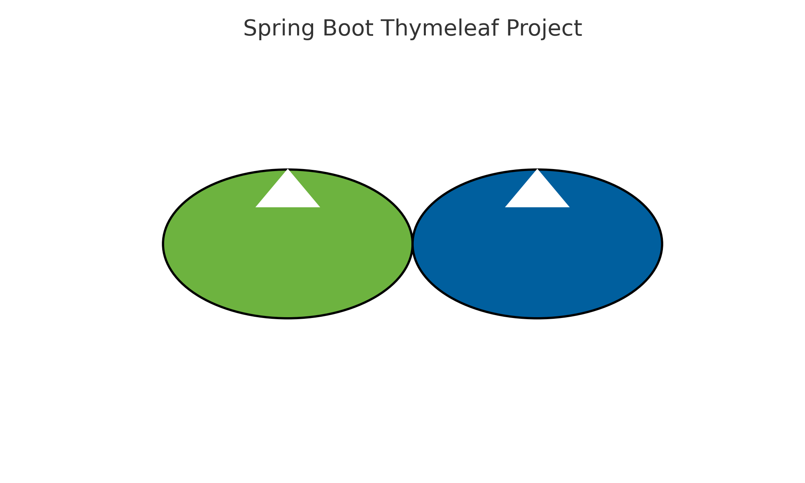
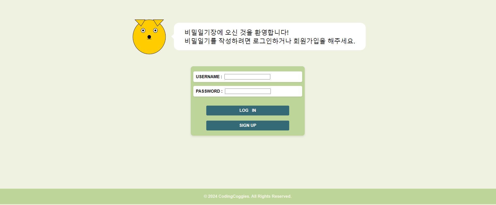
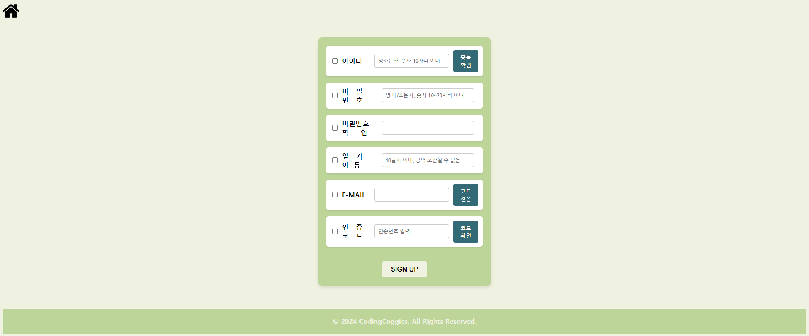
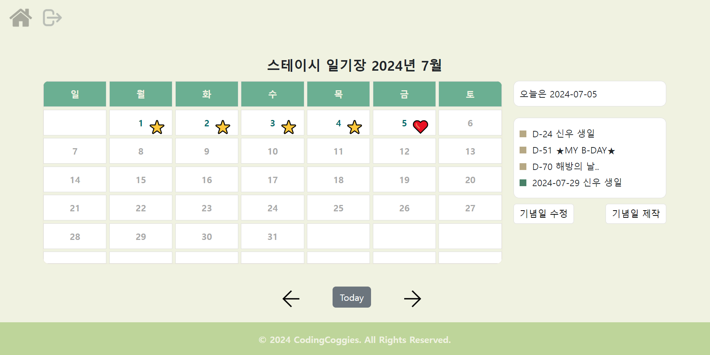
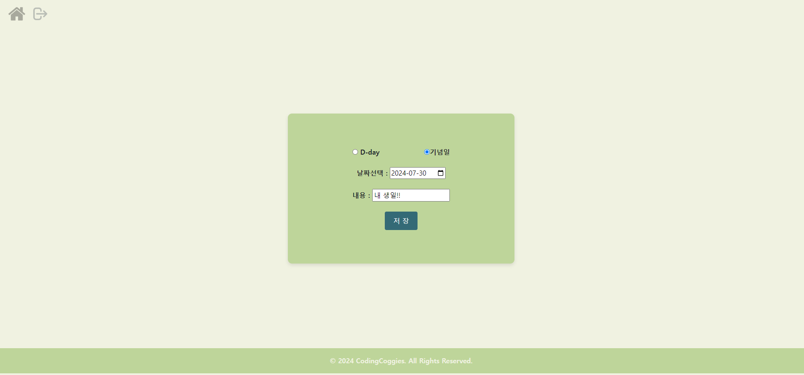
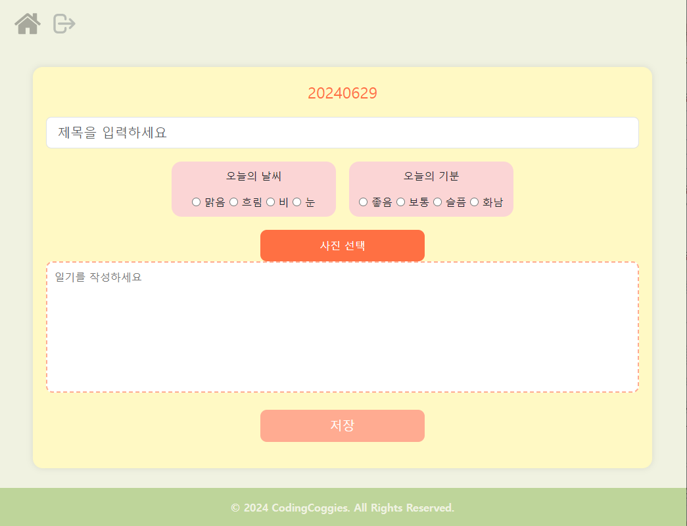
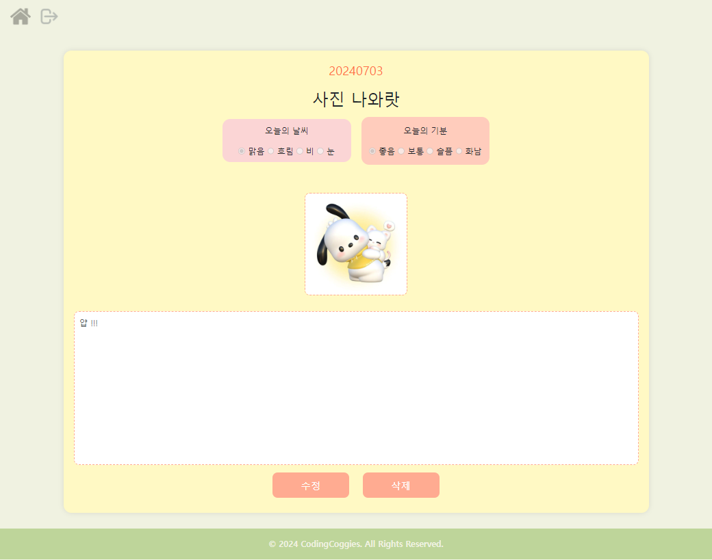
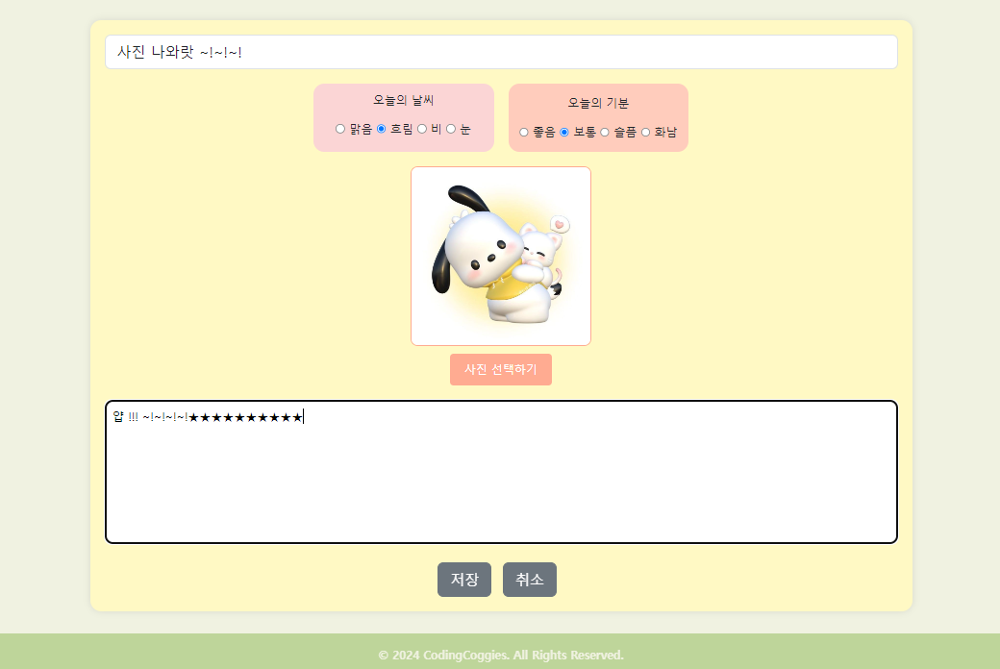

# ImageDiary
<!--배지
![MIT License][license-shield] ![Repository Size][repository-size-shield] ![Issue Closed][issue-closed-shield]

<!--프로젝트 대문 이미지


<!--프로젝트 버튼
 [![Readme in English][readme-eng-shield]][readme-eng-url] [![View Demo][view-demo-shield]][view-demo-url] [![Report bug][report-bug-shield]][report-bug-url] [![Request feature][request-feature-shield]][request-feature-url]

<!--목차
# Table of Contents
- [[1] About the Project](#1-about-the-project)
  - [Features](#features)
  - [Technologies](#technologies)
- [[2] Getting Started](#2-getting-started)
  - [Prerequisites](#prerequisites)
  - [Installation](#installation)
  - [Configuration](#configuration)
- [[3] Usage](#3-usage)
- [[4] Contribution](#4-contribution)
- [[5] Acknowledgement](#5-acknowledgement)
- [[6] Contact](#6-contact)
- [[7] License](#7-license)
-->


## 프로젝트 소개
**코딩코기스**는 '코딩하는 웰시코기들'이라는 의미를 가지고 있으며, 사용자가 사진을 등록하고 일기를 작성할 수 있는 다이어리 앱입니다. 또한, D-day와 기념일을 추가할 수 있는 캘린더 기능도 제공하여 개인적인 중요한 날들을 관리할 수 있습니다.

나만의 일기장으로 사용할 수도 있고, 계정정보를 공유한다면 연인, 친구, 가족 등과 공유도 가능합니다.


## 프로젝트 기간
2024년 06월 10일 ~ 2024년 07월 04일

<!--
## 주요 기능
- **사진 등록 및 일기 작성**: 사용자가 일기와 함께 사진을 등록할 수 있습니다.
- **캘린더 기능**: D-day와 기념일을 추가 및 관리할 수 있습니다.
## Technologies
***언어, 프레임워크, 주요 라이브러리**를 **버전**과 함께 나열하세요.*

- [Maven](https://maven.apache.org/) 3.6.3
- [MySQL](https://www.mysql.com/) 8.0
- [Spring](https://spring.io/) 2.4.3


# [2] Getting Started
*만약 운영체제에 따라 프로그램을 다르게 동작시켜야한다면, 운영체제별로 동작 방법을 설명하세요*

## Prerequisites
*프로젝트를 동작시키기 위해 필요한 소프트웨어와 라이브러리를 나열하고 어떻게 다운받을 수 있는지 설명하세요.*

- [OpenWeather API key](https://openweathermap.org/) (무료)
- npm
```bash
npm install npm@latest -g
```
-->

## 설치, 사용법
*어떻게 이 프로젝트의 소스코드를 다운받을 수 있는지 설명하세요.*

1. 레포지토리를 클론합니다:
    ```sh
    git clone https://github.com/GeonHwiAhn/ImageDiary
    ```
2. 프로젝트 디렉토리로 이동합니다:
    ```sh
    cd ImageDiary
    ```
3. 필요한 패키지를 설치합니다:
    ```sh
    npm install
    ```
4. 프로젝트를 실행합니다:
    ```sh
    npm start
    ```


## 사용 화면


- 로그인 화면


- 회원가입 화면


- 메인 달력화면


- 기념일 추가


- 기념일 수정


- 일기 작성


- 일기 열람


- 일기 수정

```java
// 몇 개의 API 사용 예제를 코드와 함께 보여주세요.
```


<!--
# [4] Contribution
기여해주신 모든 분들께 대단히 감사드립니다.[`contributing guide`][contribution-url]를 참고해주세요.
이 프로젝트의 기여하신 분들을 소개합니다! 🙆‍♀️
*이모티콘 쓰는 것을 좋아한다면, 버그 수정에 🐞, 아이디어 제공에 💡, 새로운 기능 구현에 ✨를 사용할 수 있습니다.*
- 🐞 [dev-ujin](https://github.com/): 메인페이지 버그 수정


# [5] Acknowledgement
***유사한 프로젝트의 레포지토리** 혹은 **블로그 포스트** 등 프로젝트 구현에 영감을 준 출처에 대해 링크를 나열하세요.*

- [Readme Template - Embedded Artistry](https://embeddedartistry.com/blog/2017/11/30/embedded-artistry-readme-template/)
- [How to write a kickass Readme - James.Scott](https://dev.to/scottydocs/how-to-write-a-kickass-readme-5af9)
- [Best-README-Template - othneildrew](https://github.com/othneildrew/Best-README-Template#prerequisites)
- [Img Shields](https://shields.io/)
- [Github Pages](https://pages.github.com/)
-->


## Contact
- 📧 geonhwiahn@gmail.com
- 📋 [https://github.com/GeonHwiAhn](https://www.github.io/contact)


## 라이선스
이 프로젝트는 MIT 라이선스 하에 배포됩니다. 자세한 내용은 `LICENSE` 파일을 참조하세요.


## 프로젝트 관련 URL
- GitHub Repository
 - (https://github.com/GeonHwiAhn/ImageDiary)

- Notion 페이지
 - (https://gossamer-coat-559.notion.site/coddingCoggies-1694d46b6cf4441bb9ef97e49f71879d?pvs=25)


- Figma
 -(https://www.figma.com/design/iWyq7MIhYr8V3atuu3gIRy/%ED%99%94%EB%A9%B4%EC%84%A4%EA%B3%84_%EC%BD%94%EB%94%A9%EC%BD%94%EA%B8%B0%EC%8A%A4?node-id=0-1&t=oxSF4Sx4gg0287gD-0)


<!--Url for Badges
[license-shield]: https://img.shields.io/github/license/dev-ujin/readme-template?labelColor=D8D8D8&color=04B4AE
[repository-size-shield]: https://img.shields.io/github/repo-size/dev-ujin/readme-template?labelColor=D8D8D8&color=BE81F7
[issue-closed-shield]: https://img.shields.io/github/issues-closed/dev-ujin/readme-template?labelColor=D8D8D8&color=FE9A2E

<!--Url for Buttons
[readme-eng-shield]: https://img.shields.io/badge/-readme%20in%20english-2E2E2E?style=for-the-badge
[view-demo-shield]: https://img.shields.io/badge/-%F0%9F%98%8E%20view%20demo-F3F781?style=for-the-badge
[view-demo-url]: https://dev-ujin.github.io
[report-bug-shield]: https://img.shields.io/badge/-%F0%9F%90%9E%20report%20bug-F5A9A9?style=for-the-badge
[report-bug-url]: https://github.com/dev-ujin/readme-template/issues
[request-feature-shield]: https://img.shields.io/badge/-%E2%9C%A8%20request%20feature-A9D0F5?style=for-the-badge
[request-feature-url]: https://github.com/dev-ujin/readme-template/issues

<!--URLS
[license-url]: LICENSE.md
[contribution-url]: CONTRIBUTION.md
[readme-eng-url]: ../README.md


-->